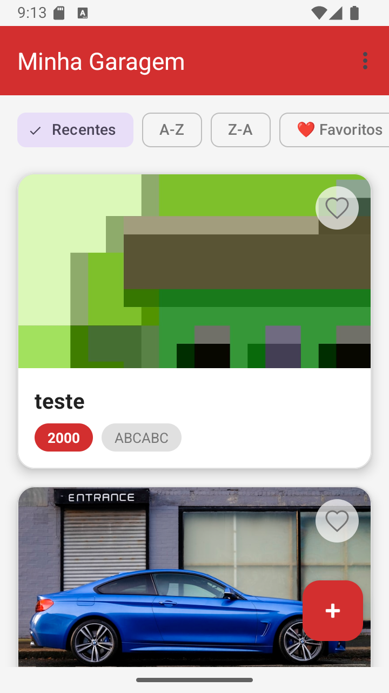
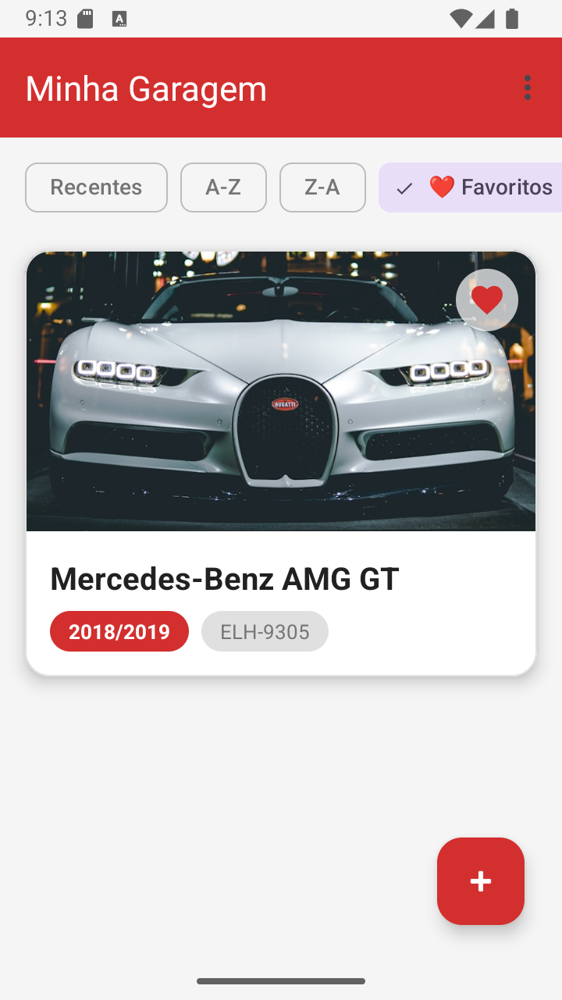
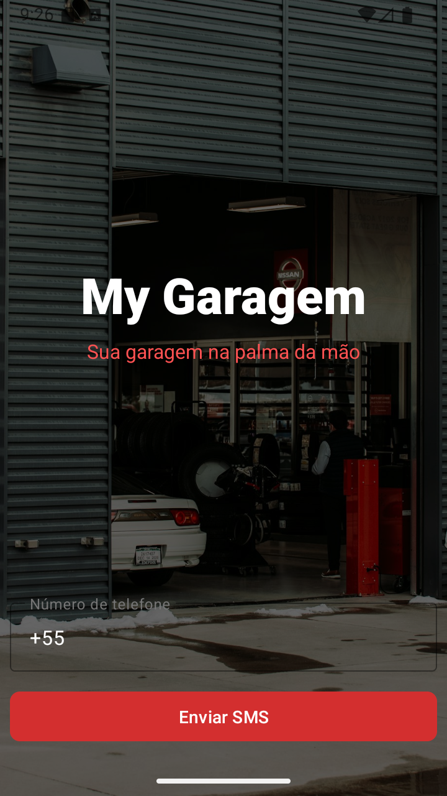

  

# 🚗 My Garagem

**Um aplicativo Android completo para o gerenciamento de coleções de veículos, integrando localização geográfica, consumo de APIs e persistência de dados.**

 

## 📖 Sobre o Projeto

O **My Garagem** é um ecossistema mobile desenvolvido para entusiastas automotivos gerenciarem sua coleção de veículos em uma garagem virtual. O aplicativo combina uma interface fluida com recursos avançados de hardware e serviços em nuvem.

Este projeto foi desenvolvido como a **Atividade Final** da disciplina de **APIs de Desenvolvimento para Dispositivos Móveis** da Especialização em Programação para Dispositivos Móveis da **Universidade Tecnológica Federal do Paraná (UTFPR)**.

- **Professor:** Prof. Vagner Martins (PayPal)
- **Desenvolvedor:** Marcos Anjos

---

## 📺 Demonstração em Vídeo

  

---

## 🔗 Links Úteis

- 📦 **Repositórios de Referência:**
  - [FTPR-Car-Android](https://github.com/vagnnermartins/FTPR-Car-Android)
  - [FTPR-Car-Api-Node-Express](https://github.com/vagnnermartins/FTPR-Car-Api-Node-Express)

---

## ✨ Requisitos da Atividade Final

O aplicativo foi desenvolvido seguindo os seguintes requisitos técnicos:

1. **Tela de Login:**
   - Autenticação via provedor **Smartphone (SMS)**.
   - **Dados para Teste:**
     - Celular: `+5511912345678`
     - Código: `123456`

2. **Gerenciamento de Sessão:**
   - Implementação de funcionalidade de **Logout** para encerramento seguro de sessão.

3. **Integração com API REST:**
   - Consumo da rota `/car` para listagem e persistência de veículos.
   - O campo `imageUrl` carrega imagens hospedadas no **Firebase Storage**.

4. **Geolocalização & Mapas:**
   - Integração com **Google Maps** para exibição e captura da localização (`place`) dos veículos.

---

## 💾 Dados da API

Para popular a API e manter a mesma listagem de carros no aplicativo, utilize os dados contidos no arquivo: **[cars_api_data.json](./cars_api_data.json)**.

---

## 🌍 Principais Funcionalidades Adicionais

### 🔐 Segurança & Acesso
- **Autenticação OTP:** Login rápido e seguro utilizando validação via SMS através do Firebase Phone Authentication.

### 🚘 Gestão da Garagem
- **Cadastro Completo:** Inserção de novos veículos com dados detalhados (nome, ano, placa) e captura fotográfica nativa.
- **Listagem Inteligente:** Filtros dinâmicos (A-Z, Z-A, Recentes) implementados com *Material3 Chips*.
- **Sistema de Favoritos:** Marcação rápida de veículos preferidos com persistência local utilizando `SharedPreferences`.

### 💾 Persistência e Dados
- **Offline-First:** Persistência robusta utilizando `Room Database` (SQLite) para garantir o funcionamento e armazenamento de localizações mesmo sem internet.

---

## 📱 Interface e Navegação

O design foi construído seguindo rigorosamente as diretrizes do **Material Design 3**, adotando uma paleta de cores focada em *Racing Red* e tons claros para maximizar o contraste e a legibilidade.

  
  &nbsp;&nbsp;&nbsp;
  
  &nbsp;&nbsp;&nbsp;
  

---

## 🛠️ Stack Tecnológica e Arquitetura

* **Linguagem:** Kotlin
* **Interface (UI):** XML / ViewBinding
* **Network:** Retrofit2 & OkHttp3
* **Imagens:** Picasso / Coil
* **Backend & Auth:** Firebase Authentication & Storage
* **Maps:** Google Maps SDK & Google Play Services Location
* **Banco de Dados Local:** Room Database & SharedPreferences

---

## 🚀 Como Executar o Projeto

1. **Clone o repositório.**
2. **Configure o Firebase:** Adicione o seu `google-services.json` na pasta `app/`.
3. **Google Maps:** Adicione sua `API_KEY` no arquivo `local.properties`.
4. **Sincronize o Gradle** e execute o app no seu dispositivo ou emulador.

---

## 👤 Autor

**Marcos Anjos**
Especialização em Programação para Dispositivos Móveis - UTFPR

---

**Desenvolvido como projeto prático para consolidar conhecimentos em integração de APIs REST, Firebase e Google Maps.**
